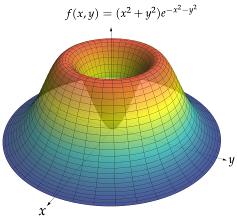
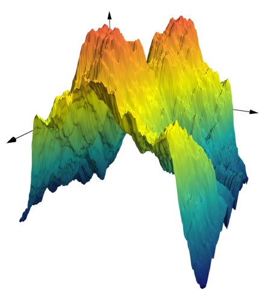

 


[](https://travis-ci.org/sswatson/AsyPlots.jl)

# AsyPlots.jl

[Documentation](https://sswatson.github.io/AsyPlots.jl/stable)

## Introduction

*AsyPlots* is a Julia package for creating figures in [Asymptote](http://asymptote.sourceforge.net). Asymptote is
a mature language for technical drawing in two and three dimensions.
This package provides access to

- Vector graphics with LaTeX-rendered labels in 2D and 3D
- An OpenGL renderer for interacting with 3D figures
- Easily customizable colors and arrows
- Convenience functions for line graphs and surface plots, with less of a time-to-first-plot penalty than some other packages
- An environment designed for working directly with graphics
  primitives (points, paths, polygons, circles, parametric surfaces)
  in natural coordinates
- in-line plotting in IJulia and Juno's plot pane
- Options to save output as asy, eps, pdf, svg, or png
- An alternative Cairo backend, for speed

## Installation

*AsyPlots* requires Asymptote, which you might already have as a part
of your TeX installation (run `asy --version` from the command line to
check). Alternatively, you can download and install it [here](https://sourceforge.net/projects/asymptote/files/2.44/). Version 2.44 is recommended. Linux and Windows binaries are available, and to install on macOS, download [asymptote-2.44.src.tgz](https://sourceforge.net/projects/asymptote/files/2.44/asymptote-2.44.src.tgz/download), unzip it, `cd` into that directory, and run

```
wget http://hboehm.info/gc/gc_source/gc-7.6.0.tar.gz
wget http://www.ivmaisoft.com/_bin/atomic_ops/libatomic_ops-7.6.0.tar.gz
./configure
make all
sudo make install
```

Asymptote can optionally use an alternative backend that relies on `Cairo.jl`, though
this package is currently not installing cleanly. 
Try 
```julia
using Homebrew
Homebrew.brew(`unlink glib`)
Homebrew.brew(`install --verbose --build-from-source https://raw.githubusercontent.com/Homebrew/homebrew-core/05871cb0394f78ef25a5c1c071456d0f1e4be4fe/Formula/glib.rb`)
Pkg.build("Cairo")
```
See [this thread](https://github.com/JuliaGraphics/Cairo.jl/issues/230) for more details. 

If you want to use the Cairo features of Asymptote, you should load Cairo first:

```julia
using Cairo
using AsyPlots
```

## Examples

```julia
using AsyPlots
n = 250; srand(1)
A = [(x,y) == (0,0) ? 0 : 1/(x^2+y^2) for x=0:n-1,y=0:n-1]
B = randn(n,n)
save("fgf.png",plot(real(fft(A.*B));width=150)) # hide
plot(real(fft(A.*B)))
```


```julia
using AsyPlots # hide
n = 100000; srand(2) # hide
x = cumsum(rand(-1:1,n))
y = cumsum(rand(-1:1,n))
save("rw.svg",Plot(Path(x,y;color="White"),   # hide
      bgcolor="Black", width=512,                 # hide
      axispen="Red",axes=true,axisarrow=Arrow())) # hide
Plot(Path(x,y;color="White"),
     bgcolor="Black",
     axispen="Red",
     axes=true,
     axisarrow=Arrow())
```

